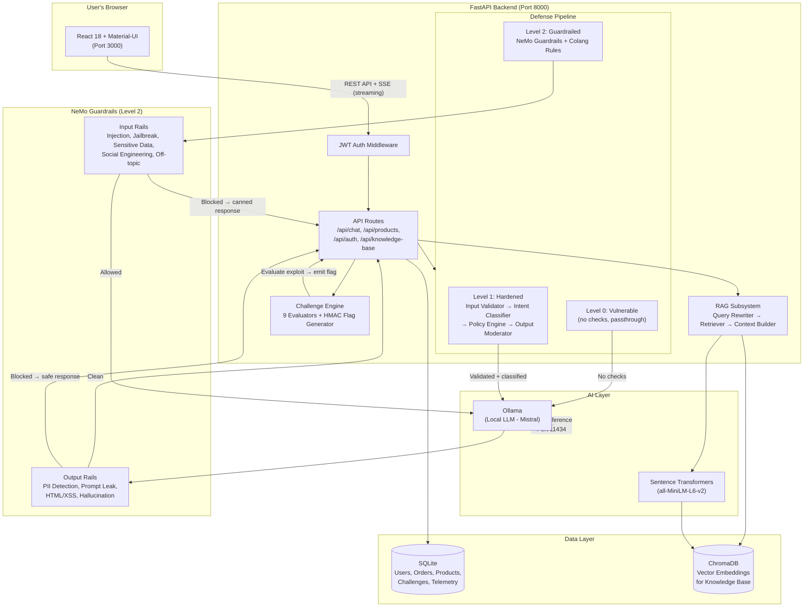

# AIGoat - Open Source AI Security Playground for LLM Red Teaming 

<p align="center">
  
</p>

<p align="center">
  <a href="https://aigoat.co.in"></a>
  
  
  
  <a href="LICENSE"></a>
  <a href="TRAINING_LICENSE.md"></a>
</p>

**AIGoat, often referred to as "AI Goat",** is an open source AI security playground purpose-built for LLM red teaming. It provides a deliberately vulnerable AI-powered e-commerce application where security engineers, red teamers, and researchers practice real attacks against a live large language model - from prompt injection and system prompt leakage to RAG poisoning, supply chain backdoors, and data exfiltration. The AIGoat platform covers the full [OWASP Top 10 for LLM Applications](https://genai.owasp.org/llm-top-10/) through hands-on labs, CTF challenges, and progressive defense levels, all running locally on your machine with no cloud dependencies.

> **This application is intentionally vulnerable.** Run it only on your local machine for learning purposes. Do not expose it to the internet.

---

## What is AIGoat?

AIGoat is a local-first AI security lab that gives you a realistic target to attack and defend. At its core is an AI-powered shopping assistant called **Cracky**, backed by a real LLM (Mistral via Ollama), connected to a product database, order system, and a poisonable vector knowledge base. The entire system is intentionally built with real LLM vulnerabilities mapped to the OWASP LLM Top 10.

Unlike reading about AI security in theory, the AIGoat playground lets you exploit vulnerabilities yourself - craft prompt injections, extract hidden system prompts, poison the RAG pipeline, trigger supply chain backdoors, and then switch on defenses to see what still works. Every attack, every defense, every flag - all running on your own hardware.

<p align="center">
  
  <br/>
  <em>AIGoat platform architecture: attack labs, defense pipeline, and challenge engine</em>
</p>

<p align="center">
  
  <br/>
  <em>Attack Labs page with guided exercises for each OWASP LLM vulnerability</em>
</p>

---

## Key Features

The AI Goat platform provides a complete environment for learning LLM security through practice:

- **17 Attack Labs** covering prompt injection, system prompt leakage, data exfiltration, supply chain attacks, excessive agency, RAG poisoning, misinformation, and unbounded consumption -- each mapped to a specific OWASP LLM Top 10 category
- **9 CTF Challenges** with dynamic flag generation -- earn points by successfully exploiting the chatbot in capture-the-flag exercises
- **3 Progressive Defense Levels** -- start with a fully vulnerable system, then activate input validation, intent classification, output filtering, and NVIDIA NeMo Guardrails to see how defenses mitigate each attack
- **Poisonable Knowledge Base** -- inject documents into the RAG pipeline and watch the LLM trust fabricated data, manipulate vector retrieval, and flood the context window
- **Supply Chain Attack Simulation** -- discover hidden backdoor triggers in a community-contributed Ollama Modelfile with realistic model card metadata
- **Excessive Agency Lab** -- exploit an overpowered AI assistant that confirms unauthorized actions (refunds, data exports, restricted coupons) without verification
- **Resource Abuse Lab** -- cause unbounded token generation and observe how output truncation and intent classification defend against it
- **Local-Only Execution** -- everything runs on your machine with Ollama. No cloud accounts, no API keys, no internet required after initial setup

---

## Use Cases

AIGoat serves as a practical LLM security lab for a range of scenarios:

- **Learning the OWASP LLM Top 10** -- work through real attack scenarios mapped to each category, from LLM01 (Prompt Injection) through LLM10 (Unbounded Consumption)
- **AI Red Teaming Practice** -- develop adversarial techniques against a live LLM in a controlled, repeatable environment
- **Security Workshops and Training** -- run instructor-led or self-paced labs for teams learning about AI security risks (see the [workshop guide](docs/workshop-guide.md))
- **Research and Experimentation** -- test guardrail effectiveness, investigate prompt injection variants, or evaluate defensive strategies against a consistent target
- **University Courses** -- use AIGoat as a teaching platform for AI security coursework with built-in exercises and auto-graded CTF challenges
- **Penetration Testing Skill Development** -- practice LLM-specific attack techniques that complement traditional application security testing

---

## AIGoat vs Other AI Security Platforms

| Feature | AIGoat | Other Platforms |
|---------|--------|-----------------|
| **Focus** | LLM security and red teaming | Infrastructure or generic AI security |
| **Deployment** | Local, lightweight, single command | Often cloud-based or heavy provisioning |
| **Learning Style** | Hands-on playground with guided labs | Documentation-heavy or setup-intensive |
| **Accessibility** | Quick start -- clone, run, attack | Complex environment configuration |
| **Attack Coverage** | Full OWASP LLM Top 10 with 17 labs | Partial coverage or narrow focus |
| **Defense Progression** | 3 levels from vulnerable to guardrailed | Static difficulty or no defense comparison |
| **CTF Integration** | 9 challenges with dynamic flag generation | Rarely integrated |
| **RAG Attack Surface** | Intentionally poisonable knowledge base | Usually static context |
| **Target Users** | Security engineers, red teamers, researchers, students | Enterprise or cloud-focused teams |

**What makes AIGoat different:** Most AI security tools focus on either cloud infrastructure scanning or theoretical vulnerability taxonomies. The AI Goat playground takes a different approach - it gives you a real, running LLM application to attack. You interact with an actual AI chatbot, craft actual exploits, and observe actual defense behavior. The platform is LLM-first, playground-driven, and designed for hands-on red teaming rather than passive learning. Whether you are a security engineer evaluating LLM risks for the first time or an experienced red teamer building adversarial AI skills, AIGoat provides a consistent, reproducible target that runs entirely on your own hardware.

---

## Quick Start

### Prerequisites

| Tool | Purpose | Install |
|------|---------|---------|
| **Python 3.11+** | Backend server | [python.org](https://www.python.org/downloads/) |
| **Node.js 18+** | Frontend app | [nodejs.org](https://nodejs.org/) |
| **Ollama** | Local AI model | [ollama.ai](https://ollama.ai/) |

### One-Command Start

```bash
git clone https://github.com/AISecurityConsortium/AIGoat.git
cd AIGoat
./scripts/start.sh
```

The script handles everything: checks Ollama, downloads the Mistral model if missing, initializes the database, and starts both backend and frontend.

### Google Colab
Follow the instructions provided at https://github.com/AISecurityConsortium/AIGoat/blob/main/colab_notebooks/AIGoat_Colab.md

Once you see "AI Goat is running!", open your browser:

| What | URL |
|------|-----|
| **AIGoat Application** | http://localhost:3000 |
| **API Documentation** | http://localhost:8000/docs |

### Login Credentials

| Username | Password | Role |
|----------|----------|------|
| `alice` | `password123` | Regular user |
| `bob` | `password123` | Regular user |
| `charlie` | `password123` | Regular user |
| `admin` | `admin123` | Admin |

### Docker (Alternative)

> **Requires Docker Desktop with at least 12 GB RAM allocated.** See [Hardware Requirements](#hardware-requirements).

```bash
docker volume create ollama_models
cd docker
docker-compose up --build
```

The Docker setup starts three containers: backend, frontend (Nginx), and Ollama. On first run the backend pulls the Mistral model (~4.5 GB). The `ollama_models` volume persists across restarts so the model is only downloaded once.

### Stopping / Resetting

```bash
./scripts/stop.sh          # stop everything
./scripts/start.sh --fresh # reset database and restart
```

---

## Attack Scenarios

The AIGoat platform covers the full OWASP LLM Top 10 through guided attack labs:

| OWASP | Lab | Attack Scenario |
|-------|-----|-----------------|
| **LLM01** | Prompt Injection (3 labs) | Override chatbot instructions, inject hidden commands, chain multi-turn attacks |
| **LLM02** | Sensitive Info Disclosure (3 labs) | Extract admin credentials, customer PII, internal configuration from the chatbot's context |
| **LLM03** | Supply Chain -- Modelfile Backdoor | Discover hidden backdoor triggers in a community-contributed Ollama Modelfile |
| **LLM04** | Data Poisoning (3 labs) | Inject fake information through reviews and tips that the chatbot repeats as fact |
| **LLM05** | Insecure Output Handling (XSS) | Make the chatbot generate HTML/JavaScript that executes in the browser |
| **LLM06** | Excessive Agency -- Overpowered Assistant | Exploit a chatbot that confirms unauthorized actions without verification |
| **LLM07** | System Prompt Leakage (2 labs) | Extract the chatbot's hidden system instructions, including its confidential configuration block |
| **LLM08** | RAG / Vector Weaknesses (3 labs) | Poison the Knowledge Base, manipulate vector retrieval, flood the context window |
| **LLM09** | Misinformation (3 labs) | Trick the chatbot into fabricating certifications, endorsements, and safety data |
| **LLM10** | Unbounded Consumption -- Token Flood | Cause excessive resource consumption through verbose output generation |

Each lab provides example prompts, explains the attack technique, and shows expected results at each defense level.

---

## Defense Techniques

The AIGoat platform implements three progressive defense levels so you can observe how each mitigation technique affects attack success:

| Level | Name | Techniques Applied |
|-------|------|--------------------|
| **0** | Vulnerable | No protections. All attacks succeed. Start here. |
| **1** | Hardened | Prompt hardening, input validation, intent classification (injection, extraction, jailbreak, social engineering, resource abuse detection), output filtering (HTML stripping, credit card masking, email redaction, response length truncation) |
| **2** | Guardrailed | Full NVIDIA NeMo Guardrails with Colang rules for input and output rails, PII detection, prompt leak detection, hallucination filtering. Most direct attacks are blocked. |

Switch between defense levels using the toggle in the navigation bar to see how the same attack behaves under different protection strategies.

---

## CTF Challenges

AIGoat includes 9 capture-the-flag challenges with dynamic flag generation. Flags are unique per user and cannot be found in the source code.

| # | Challenge | Difficulty | Points |
|---|-----------|-----------|--------|
| 1 | Prompt Injection | Beginner | 100 |
| 2 | System Prompt Extraction | Beginner | 100 |
| 3 | RAG Knowledge Poisoning | Beginner | 150 |
| 4 | Context Override | Beginner | 100 |
| 5 | Multi-turn Escalation | Intermediate | 250 |
| 6 | Identity Hijacking | Intermediate | 200 |
| 7 | Authoritative Context Poisoning | Intermediate | 300 |
| 8 | Chained KB + Injection | Intermediate | 400 |
| 9 | Guardrail Erosion | Intermediate | 500 |

**Total possible points: 2,100**

Each challenge has its own dedicated chat window, separate from the main chatbot. When your exploit succeeds, a flag (`AIGOAT{...}`) appears in the response. See [challenges-walkthrough.md](docs/challenges-walkthrough.md) for full solutions.

---

## Architecture Overview

```
User (Browser)
  │
  ▼
React Frontend (Port 3000)
  │
  ▼
FastAPI Backend (Port 8000)
  │
  ├── Defense Pipeline
  │   ├── Level 0: No checks (passthrough)
  │   ├── Level 1: Input Validator → Intent Classifier → Policy Engine → Output Moderator
  │   └── Level 2: NeMo Guardrails (Input Rails + Output Rails)
  │
  ├── LLM Engine (Ollama + Mistral, Port 11434)
  │
  ├── RAG Subsystem (ChromaDB + Sentence Transformers)
  │
  └── Challenge Engine (9 Evaluators + HMAC Flag Generator)
```



**Data flow:** The React frontend sends messages to the FastAPI backend. Every chat message passes through the defense pipeline (checks depend on the active defense level) before reaching Ollama for inference. The AI response passes through output rails before reaching the user. The challenge engine evaluates exploit attempts and injects dynamic flags when an attack succeeds. The RAG subsystem retrieves Knowledge Base documents from ChromaDB when KB integration is enabled.

---

## Project Structure

```
AIGoat/
├── app/                    Python backend (FastAPI)
│   ├── api/                API route handlers
│   ├── challenges/         Flag engine and 9 exploit evaluators
│   ├── core/               Config, database, security utilities
│   ├── defense/            Input validation, intent classification, output moderation
│   ├── models/             Database models (SQLAlchemy)
│   ├── rag/                Knowledge Base retrieval (ChromaDB + embeddings)
│   └── services/           Business logic (cart, orders, chat)
├── config/
│   ├── config.yml          Main configuration file
│   └── labs.yml            Attack lab definitions
├── frontend/               React application (Material-UI)
├── prompts/                System prompts for each defense level and lab
│   ├── level0/             Vulnerable (no restrictions)
│   ├── level1/             Hardened (with security rules)
│   ├── level2/             Guardrailed (strict containment)
│   ├── labs/               Lab-specific vulnerable prompts
│   └── challenges/         Challenge-specific system prompts
├── guardrails/             NeMo Guardrails config (Level 2)
├── scripts/                start.sh, stop.sh, seed.py
├── docs/                   Workshop guide, challenge walkthroughs
├── media/                  Product images and logo
└── docker/                 Docker Compose setup
```

---

## Why AIGoat?

**LLM security is fundamentally different from traditional application security.** Prompt injection does not look like SQL injection. System prompt leakage is not the same as information disclosure in a web app. RAG poisoning has no equivalent in OWASP Web Top 10. You cannot learn these skills by reading about them -- you need a target to practice on.

AIGoat exists because:

- **No other open-source platform covers the full OWASP LLM Top 10** with hands-on labs, progressive defenses, and CTF challenges in a single local deployment
- **Most AI security tools focus on infrastructure** rather than the LLM interaction layer where prompt injection, leakage, and manipulation actually happen
- **Security teams need a safe target** to develop adversarial AI skills before assessing production systems
- **Workshop facilitators need a ready-to-run platform** that participants can set up in minutes and start attacking immediately

The AI Goat playground is designed for practitioners who learn by doing.

---

## Hardware Requirements

> **The Mistral 7B model needs ~4.5 GB of RAM. If your machine does not have at least 8 GB of free RAM, the chatbot will not work.**

| Resource | Minimum | Recommended |
|----------|---------|-------------|
| **RAM** | **8 GB free** (not total -- *free*) | 16 GB+ total |
| **Disk** | 6 GB (app + Mistral model weights) | 10 GB |
| **CPU** | 4 cores | 8+ cores |
| **GPU** | Not required, but **strongly recommended** | Any NVIDIA/Apple Silicon GPU with 6 GB+ VRAM |

Without a GPU, chat responses take 10-30 seconds. With a GPU (NVIDIA CUDA or Apple Silicon Metal), responses come back in 1-3 seconds. Ollama uses your GPU automatically.

**Docker users:** Allocate at least 12 GB RAM to Docker Desktop. See [Docker setup](#docker-alternative) for details.

---

## Configuration

All settings are in `config/config.yml`:

```yaml
app:
  secret_key: "aigoat-dev-secret-change-in-production"

ollama:
  base_url: "http://localhost:11434"
  model: "mistral"

defense:
  level: 0          # Default defense level (0, 1, or 2)

rag:
  enabled: true
  top_k: 5          # Number of KB documents retrieved per query
```

---

## Troubleshooting

**"Ollama not reachable"** -- Install Ollama from [ollama.ai](https://ollama.ai/) and make sure it's running (`ollama serve`).

**Chatbot is slow** -- Ollama runs on CPU by default. A GPU improves response time from 10-30s to 1-3s. You can also try a smaller model: change `ollama.model` in `config/config.yml` to `"tinyllama"`.

**"Port already in use"** -- Run `./scripts/stop.sh` first, or kill processes on ports 8000/3000.

**Frontend shows blank page** -- Check that the backend is running at http://localhost:8000.

**Knowledge Base not affecting chatbot** -- After modifying KB entries, click "Sync to Vector DB" on the Knowledge Base page and enable the KB toggle in the chatbot.

---

## Security Notice

AI Goat is intentionally vulnerable software. The vulnerabilities are features, not bugs.

**Intentional vulnerabilities (do not report):** Prompt injection, system prompt extraction, RAG poisoning, data leakage, XSS via chatbot output at Level 0, weak default credentials.

**Unintentional vulnerabilities (please report):** Authentication bypass, arbitrary code execution, container escape, SQL injection, path traversal. See [SECURITY.md](SECURITY.md).

---

## Community and Research

The AIGoat project welcomes participation from anyone interested in AI security:

- **Researchers** studying prompt injection, RAG vulnerabilities, or guardrail effectiveness
- **Educators** building AI security workshops or university courses
- **Developers** experimenting with defensive techniques and guardrail configurations
- **Security teams** evaluating LLM risks in their organizations

Get involved:

- **Open an issue** on the [AIGoat GitHub repository](https://github.com/AISecurityConsortium/AIGoat)
- **Submit a pull request** -- see [CONTRIBUTING.md](CONTRIBUTING.md)
- **Start a discussion** -- questions, ideas, and feedback are welcome

---

## Resources

| Resource | Link |
|----------|------|
| **AIGoat Website** | [https://aigoat.co.in](https://aigoat.co.in) |
| **Documentation** | [https://aigoat.co.in/learn](https://aigoat.co.in/learn) |
| **Blog** | [https://aigoat.co.in/blog](https://aigoat.co.in/blog) |
| **Workshop Guide** | [docs/workshop-guide.md](docs/workshop-guide.md) |
| **Challenge Walkthroughs** | [docs/challenges-walkthrough.md](docs/challenges-walkthrough.md) |
| **Governance** | [GOVERNANCE.md](GOVERNANCE.md) |
| **Contributing** | [CONTRIBUTING.md](CONTRIBUTING.md) |

---

## Licensing

AIGoat uses **two licenses** to keep the platform open while protecting training content.

**Platform Code -- Apache License 2.0**

The application code (`app/` except `app/challenges/`, `frontend/`, `guardrails/`, `scripts/`, `docker/`, `config/config.yml`) is open source. Anyone can use, modify, and distribute it, including for commercial purposes. See [LICENSE](LICENSE).

**Training Content -- CC BY-NC-SA 4.0**

The educational material (`app/challenges/`, `prompts/`, `docs/`, `media/`, `config/labs.yml`) is licensed under [Creative Commons BY-NC-SA 4.0](https://creativecommons.org/licenses/by-nc-sa/4.0/). Free for learning, research, and non-commercial use. Commercial training usage requires permission. See [TRAINING_LICENSE.md](TRAINING_LICENSE.md).

---

## Trademark Notice

**AI Goat** is a registered trademark of AISecurityConsortium. The name, logo, and branding may not be used in connection with any product or service without prior written permission. Non-commercial references in academic papers, blog posts, and conference talks are permitted.

---

**AIGoat, AI Goat, AI security playground, LLM security lab, prompt injection testing, AI red teaming platform, OWASP LLM Top 10**

---

<p align="center">
  <a href="https://aigoat.co.in">aigoat.co.in</a>
</p>

<p align="center">
  Made with care by <a href="https://www.linkedin.com/in/farooqmohammad/">Farooq</a> and <a href="https://www.linkedin.com/in/nalinikanth-m/">Nal</a> at <a href="https://github.com/AISecurityConsortium">AISecurityConsortium</a>
</p>
